# Mark

**Mark** is an AI-powered educational assessment platform that automates grading, provides intelligent feedback, and supports multilingual learning at scale.

---

## Quick Links

- [Getting Started](#getting-started)
- [Key Features](#key-features)
- [Technology Stack](#technology-stack)
- [Contributing](./docs/CONTRIBUTING.md)
- [Architecture Overview](#architecture-overview)

---

## Getting Started

### For Contributors

1. **Clone the repository**

   ```bash
   git clone https://github.com/ibm-skills-network/mark.git
   cd mark
   ```

2. **Follow the setup guide**
   See [CONTRIBUTING.md](./docs/CONTRIBUTING.md) for detailed setup instructions, environment configuration, and development workflows.

3. **Pick an issue**
   Browse the [project board](https://github.com/orgs/ibm-skills-network/projects/9) and assign yourself an issue.

### For Users

Mark is designed for educational institutions looking to scale their assessment capabilities with AI assistance. Contact the team for deployment options.

---

## Key Features

- **AI-Assisted Grading** - Automated evaluation with customizable rubrics
- **Multi-Format Support** - Text, file uploads, URLs, presentations, videos
- **Multilingual** - Translate assignments and feedback into multiple languages
- **Real-Time Progress** - Track grading jobs and student attempts
- **Flexible Architecture** - Modular, extensible, and production-ready

---

## Technology Stack

| Layer          | Technology                                   |
| -------------- | -------------------------------------------- |
| **Backend**    | NestJS (TypeScript)                          |
| **Database**   | PostgreSQL + Prisma ORM                      |
| **AI/LLM**     | OpenAI GPT-4o, extensible to other providers |
| **Messaging**  | NATS                                         |
| **Testing**    | Jest                                         |
| **Deployment** | Docker, GitHub Actions                       |

---

## Architecture Overview

Mark follows a **domain-driven, service-oriented architecture** with clear separation of concerns:

### Layers

1. **API Layer** - Controllers for assignments, questions, attempts, reports
2. **Service Layer** - Business logic, grading strategies, translation, job processing
3. **Repository Layer** - Data access abstraction
4. **Data Layer** - PostgreSQL with Prisma, caching
5. **LLM Integration** - Facade pattern for AI providers, token tracking, moderation

### Design Principles

- **Repository Pattern** - Centralized data access, improved testability
- **Dependency Injection** - Loose coupling, easier testing
- **Strategy Pattern** - Pluggable grading strategies per question type
- **Rate Limiting** - Bottleneck.js for API throttling
- **Job Queues** - Background processing for long-running tasks
- **Health Monitoring** - System checks and recovery mechanisms

```mermaid
graph TD

%% ─────────────── CLIENT ───────────────
subgraph "Client Layer"
  direction TB
  UI["User Interface"] --> API["API Gateway"]
end

%% ─────────────── API ────────────────
subgraph "API Layer"
  direction TB
  API --> AC["Assignment Controller"]
  API --> QC["Question Controller"]
  API --> ATC["Attempt Controller"]
  API --> RC["Reports Controller"]
  API --> GHC["GitHub Controller"]
  API --> JSC["Job Status Controller"]
end

%% ─────────────── SERVICE ─────────────
subgraph "Service Layer"
  direction TB
  %% Assignment
  AC --> AS["Assignment Service"]
  %% Question
  QC --> QS["Question Service"]
  %% Attempt
  ATC --> ATS["Attempt Service"]
  ATS --> AFS["Attempt Feedback Service"]
  ATS --> AGS["Attempt Grading Service"]
  ATS --> ARS["Attempt Regrading Service"]
  ATS --> ARPS["Attempt Reporting Service"]
  ATS --> ASBS["Attempt Submission Service"]
  ATS --> AVS["Attempt Validation Service"]
  ATS --> QRPS["Question Response Service"]
  %% Reports
  RC --> RS["Reports Service"]
  RS --> FLS["Flo Service"]
  %% GitHub
  GHC --> GHS["GitHub Service"]
  %% Translation links
  QS --> TS["Translation Service"]
  AS --> TS
  %% Job-status links
  JSC --> JSS["Job Status Service"]
  QS --> JSS
  %% Grading factory
  QRPS --> GFS["Grading Factory Service"]
  GFS --> TGS["Text Grading Strategy"]
  GFS --> FGS["File Grading Strategy"]
  GFS --> UGS["URL Grading Strategy"]
  GFS --> PGS["Presentation Grading Strategy"]
  GFS --> CGS["Choice Grading Strategy"]
  GFS --> TFGS["True/False Grading Strategy"]
  %% Variants
  QS --> QVS["Question Variant Service"]
end

%% ─────────────── REPOSITORY ──────────
subgraph "Repository Layer"
  direction TB
  AS --> AR["Assignment Repository"]
  QS --> QR["Question Repository"]
  QS --> VR["Variant Repository"]
  TS --> TR["Translation Repository"]
  RS --> RR["Reports Repository"]
  GHS --> GHR["GitHub Repository"]
  JSS --> JSR["Job Status Repository"]
end

%% ─────────────── DATA ────────────────
subgraph "Data Layer"
  direction TB
  AR --> PS["Prisma Service"]
  QR --> PS
  VR --> PS
  TR --> PS
  RR --> PS
  GHR --> PS
  JSR --> PS
  PS --> DB["PostgreSQL Database"]
    direction TB
  TS --> Cache["Translation cache"]
  QS --> Cache
  AGS --> Cache
  Cache --> DB
end

%% ─────────────── LLM INTEGRATION ─────
subgraph "LLM Integration Layer"
  direction TB
  AS --> LFS["LLM Facade Service"]
  QS --> LFS
  TS --> LFS
  TGS --> LFS
  FGS --> LFS
  UGS --> LFS
  PGS --> LFS
  LFS --> PP["Prompt Processor"]
  LFS --> MS["Moderation Service"]
  LFS --> TC["Token Counter"]
  LFS --> UT["Usage Tracker"]
  LFS --> GMS["Grading Audit Service"]
  LFS --> LLMTGS["LLM Text Grading"]
  LFS --> LLMFGS["LLM File Grading"]
  LFS --> LLMIGS["LLM Image Grading"]
  LFS --> LLMUGS["LLM URL Grading"]
  LFS --> LLMPGS["LLM Presentation Grading"]
  LFS --> LLMVGS["LLM Video Grading"]
  LFS --> QGS["Question Generation"]
  LFS --> VGS["Variant Generation"]
  LFS --> RSS["Rubric Service"]
  LFS --> LLMTS["LLM Translation Service"]
  PP --> Router["LLM Router"]
  subgraph "LLM Providers"
    direction TB
    Router --> OLP["OpenAI gpt-4o"]
    Router --> OMP["OpenAI gpt-4o-mini"]
    Router --> FP["Future Provider"]
  end
  OLP --> OpenAI["OpenAI API"]
  OMP --> OpenAI
  FP --> OtherAPI["Other AI API"]
end

%% ─────────────── EXTERNAL ────────────
subgraph "External Services"
  direction TB
  FLS --> NATS["NATS Messaging"]
  GHS --> GHAPI["GitHub API"]
  RS  --> GHAPI
end

%% ─────────────── UTILITY ─────────────
subgraph "Utility Services"
  direction TB
  LS["Localization Service"]
  TGS --> LS
  FGS --> LS
  UGS --> LS
  PGS --> LS
  CGS --> LS
  TFGS --> LS
  BN["Rate Limiter"]
  PP --> BN
  TS --> BN
  Logger["Logger Service"]
  PP --> Logger
  AS --> Logger
  QS --> Logger
  TS --> Logger
end

%% ─────────────── BACKGROUND JOBS ─────
subgraph "Background Processing"
  direction TB
  QS --> JPQ["Job Processing Queue"]
  TS --> JPQ
  AS --> JPQ
  JPQ --> W1["Worker 1"]
  JPQ --> W2["Worker 2"]
  JPQ --> W3["Worker 3"]
  W1 --> LFS
  W2 --> LFS
  W3 --> LFS
  JSS --> JPQ
end

%% ─────────────── MONITORING ──────────
subgraph "Monitoring System"
  direction TB
  Logger --> ELK["Logging Stack"]
  BN --> Metrics["Metrics System"]
  JSS --> Metrics
end

%% ─────────────── COLOUR CLASSES ─────
classDef clientLayer    fill:#b3e0ff,stroke:#005b9f,color:#000,font-weight:bold;
classDef apiLayer       fill:#c6ffad,stroke:#2a7000,color:#000,font-weight:bold;
classDef serviceLayer   fill:#ffdeb3,stroke:#b35900,color:#000,font-weight:bold;
classDef repositoryLayer fill:#e6c3ff,stroke:#4b0082,color:#000,font-weight:bold;
classDef dataLayer      fill:#ffb3b3,stroke:#990000,color:#000,font-weight:bold;
classDef llmLayer       fill:#b3fff0,stroke:#006666,color:#000,font-weight:bold;
classDef utilityLayer   fill:#ffffb3,stroke:#666600,color:#000,font-weight:bold;
classDef jobLayer       fill:#e6ffcc,stroke:#336600,color:#000,font-weight:bold;
classDef cacheLayer     fill:#ffc2b3,stroke:#993300,color:#000,font-weight:bold;
classDef monitoringLayer fill:#cccccc,stroke:#333333,color:#000,font-weight:bold;
classDef externalLayer  fill:#d4a3ff,stroke:#4b0082,color:#000,font-weight:bold;

class UI,API clientLayer
class AC,QC,ATC,RC,GHC,JSC apiLayer
class AS,QS,ATS,AFS,AGS,ARS,ARPS,ASBS,AVS,QRPS,RS,FLS,GHS,TS,JSS,GFS,TGS,FGS,UGS,PGS,CGS,TFGS,QVS serviceLayer
class AR,QR,VR,TR,RR,GHR,JSR repositoryLayer
class PS,DB dataLayer
class LFS,PP,MS,TC,UT,GMS,LLMTGS,LLMFGS,LLMIGS,LLMUGS,LLMPGS,LLMVGS,QGS,VGS,RSS,LLMTS,Router,OLP,OMP,FP,OpenAI,OtherAPI llmLayer
class LS,BN,Logger utilityLayer
class JPQ,W1,W2,W3 jobLayer
class Cache cacheLayer
class ELK,Metrics,Socket monitoringLayer
class NATS,GHAPI externalLayer
```

<details>
<summary><strong>View Detailed Architecture Diagram</strong></summary>



</details>

---

## Contributing

We welcome contributions! Here's how to get started:

1. **Read the guidelines** - [CONTRIBUTING.md](./docs/CONTRIBUTING.md)
2. **Pick an issue** - Browse the [project board](https://github.com/orgs/ibm-skills-network/projects/9)
3. **Follow conventions** - Conventional Commits for all PRs and commits
4. **Submit PR** - Include tests and ensure CI passes

All commits and PR titles must follow [Conventional Commits](https://www.conventionalcommits.org/) format (enforced via Husky and CI).

---

## Acknowledgments

Built with NestJS, PostgreSQL, Prisma, OpenAI, and the support of the education technology community.
