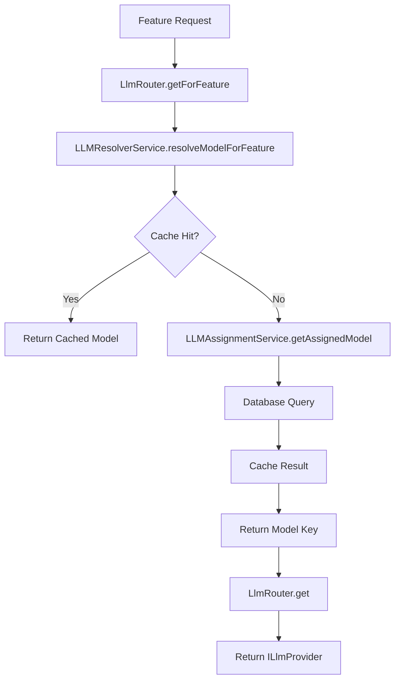
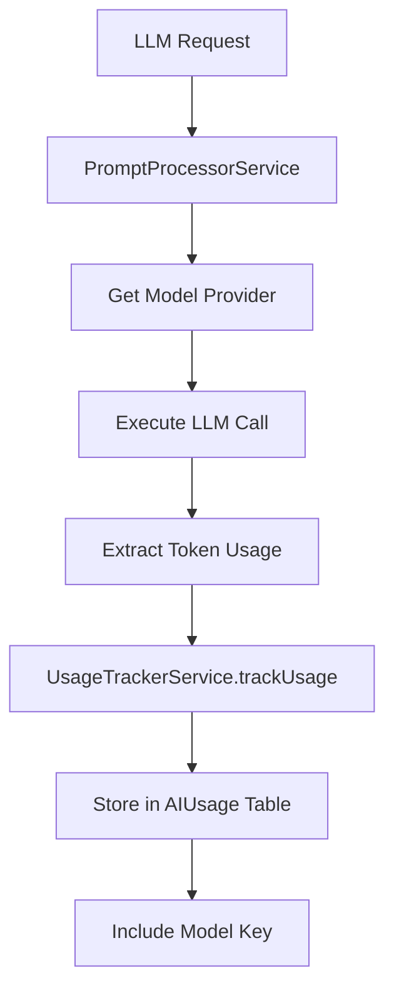
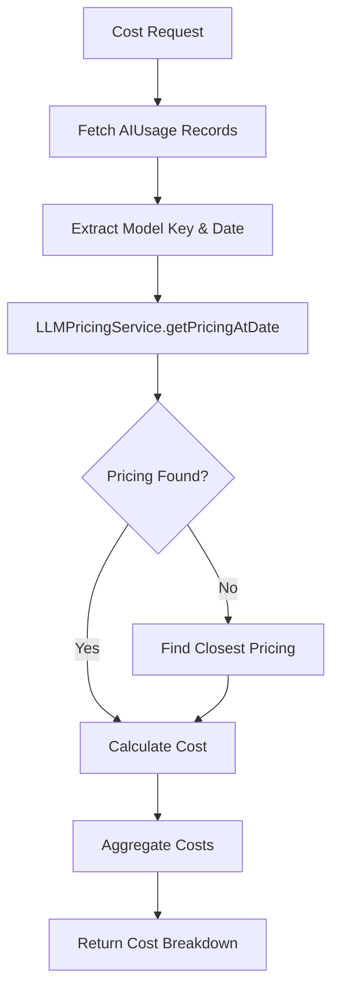

# LLM Architecture Documentation

## Overview

The LLM (Large Language Model) architecture provides a centralized, flexible, and scalable system for managing AI model usage across different features in the application. The architecture supports dynamic model assignment, cost tracking, usage analytics, and seamless integration of new AI providers.

## Core Principles

- **Dynamic Model Assignment**: Features can be dynamically assigned to different LLM models without code changes
- **Cost Tracking**: Accurate historical cost tracking with proper model attribution
- **Abstraction**: Clean separation between business logic and LLM implementation details
- **Scalability**: Easy addition of new models and providers
- **Observability**: Comprehensive usage tracking and analytics

## Architecture Components

### 1. Database Layer

#### Core Models

**`LLMModel`**

- Represents available LLM models in the system
- Stores model metadata (provider, display name, active status)
- Primary key for all model-related operations

```sql
CREATE TABLE "LLMModel" (
    "id" SERIAL PRIMARY KEY,
    "modelKey" TEXT UNIQUE NOT NULL,     -- e.g., 'gpt-4o', 'gpt-4o-mini'
    "displayName" TEXT NOT NULL,         -- e.g., 'GPT-4 Omni'
    "provider" TEXT NOT NULL,            -- e.g., 'OpenAI'
    "isActive" BOOLEAN DEFAULT true,
    "createdAt" TIMESTAMP DEFAULT NOW(),
    "updatedAt" TIMESTAMP NOT NULL
);
```

**`AIFeature`**

- Defines AI-powered features in the system
- Each feature can be assigned to different models
- Contains fallback configuration

```sql
CREATE TABLE "AIFeature" (
    "id" SERIAL PRIMARY KEY,
    "featureKey" TEXT UNIQUE NOT NULL,   -- e.g., 'text_grading'
    "featureType" AIFeatureType NOT NULL,
    "displayName" TEXT NOT NULL,
    "description" TEXT,
    "isActive" BOOLEAN DEFAULT true,
    "requiresModel" BOOLEAN DEFAULT true,
    "defaultModelKey" TEXT,              -- Fallback model
    "createdAt" TIMESTAMP DEFAULT NOW(),
    "updatedAt" TIMESTAMP NOT NULL
);
```

**`LLMFeatureAssignment`**

- Maps AI features to specific LLM models
- Enables dynamic model switching
- Tracks assignment history and metadata

```sql
CREATE TABLE "LLMFeatureAssignment" (
    "id" SERIAL PRIMARY KEY,
    "featureId" INTEGER REFERENCES "AIFeature"(id),
    "modelId" INTEGER REFERENCES "LLMModel"(id),
    "isActive" BOOLEAN DEFAULT true,
    "priority" INTEGER DEFAULT 0,
    "assignedBy" TEXT,
    "assignedAt" TIMESTAMP DEFAULT NOW(),
    "deactivatedAt" TIMESTAMP,
    "metadata" JSONB
);
```

**`LLMPricing`**

- Stores historical pricing data for accurate cost calculations
- Supports multiple pricing sources and time-based pricing

```sql
CREATE TABLE "LLMPricing" (
    "id" SERIAL PRIMARY KEY,
    "modelId" INTEGER REFERENCES "LLMModel"(id),
    "inputTokenPrice" DOUBLE PRECISION NOT NULL,
    "outputTokenPrice" DOUBLE PRECISION NOT NULL,
    "effectiveDate" TIMESTAMP NOT NULL,
    "source" PricingSource NOT NULL,
    "isActive" BOOLEAN DEFAULT true,
    "metadata" JSONB
);
```

**`AIUsage`**

- Tracks actual AI usage with model attribution
- Enables accurate cost calculation and analytics

```sql
CREATE TABLE "AIUsage" (
    "id" SERIAL PRIMARY KEY,
    "assignmentId" INTEGER REFERENCES "Assignment"(id),
    "usageType" AIUsageType NOT NULL,
    "tokensIn" INTEGER DEFAULT 0,
    "tokensOut" INTEGER DEFAULT 0,
    "usageCount" INTEGER DEFAULT 0,
    "modelKey" TEXT,                     -- Actual model used
    "createdAt" TIMESTAMP DEFAULT NOW()
);
```

#### Enums

**`AIFeatureType`**

```sql
CREATE TYPE "AIFeatureType" AS ENUM (
    'TEXT_GRADING',
    'FILE_GRADING',
    'IMAGE_GRADING',
    'URL_GRADING',
    'PRESENTATION_GRADING',
    'VIDEO_GRADING',
    'QUESTION_GENERATION',
    'TRANSLATION',
    'RUBRIC_GENERATION',
    'CONTENT_MODERATION',
    'ASSIGNMENT_GENERATION',
    'LIVE_RECORDING_FEEDBACK'
);
```

### 2. Service Layer

#### Core Services

**`LlmRouter`** (`src/api/llm/core/services/llm-router.service.ts`)

- Central registry of available LLM providers
- Routes requests to appropriate model based on feature assignments
- Provides fallback mechanisms

Key Methods:

```typescript
get(key: string): ILlmProvider                    // Get provider by model key
getForFeature(featureKey: string): Promise<ILlmProvider>  // Get assigned model
getAvailableModelKeys(): string[]                 // List all available models
```

**`LLMAssignmentService`** (`src/api/llm/core/services/llm-assignment.service.ts`)

- Manages feature-to-model assignments
- Handles bulk operations and history tracking
- Provides assignment statistics

Key Methods:

```typescript
getAssignedModel(featureKey: string): Promise<string | null>
assignModelToFeature(featureKey: string, modelKey: string): Promise<void>
bulkAssignModels(assignments: Assignment[]): Promise<BulkResult>
resetToDefaults(): Promise<ResetResult>
```

**`LLMResolverService`** (`src/api/llm/core/services/llm-resolver.service.ts`)

- Caching layer for model resolution (5-minute TTL)
- Performance optimization for frequent model lookups
- Cache invalidation on assignment changes

**`LLMPricingService`** (`src/api/llm/core/services/llm-pricing.service.ts`)

- Manages pricing data and cost calculations
- Supports historical pricing with fallback logic
- Provides cost breakdowns and analytics

Key Methods:

```typescript
getPricingAtDate(modelKey: string, date: Date): Promise<ModelPricing | null>
calculateCostWithBreakdown(modelKey: string, inputTokens: number, outputTokens: number, usageDate: Date): Promise<CostBreakdown | null>
updatePricingHistory(pricingData: ModelPricing[]): Promise<number>
```

**`PromptProcessorService`** (`src/api/llm/core/services/prompt-processor.service.ts`)

- Processes prompts using assigned models
- Handles usage tracking with model attribution
- Supports both text and image processing

Key Methods:

```typescript
processPromptForFeature(prompt: PromptTemplate, assignmentId: number, usageType: AIUsageType, featureKey: string, fallbackModel?: string): Promise<string>
processPrompt(prompt: PromptTemplate, assignmentId: number, usageType: AIUsageType, llmKey?: string): Promise<string>
```

**`UsageTrackerService`** (`src/api/llm/core/services/usage-tracking.service.ts`)

- Tracks AI usage with model attribution
- Aggregates usage statistics
- Supports cost calculation queries

### 3. Provider Layer

#### Interface Definition

**`ILlmProvider`** (`src/api/llm/core/interfaces/llm-provider.interface.ts`)

```typescript
export interface ILlmProvider {
  readonly key: string;

  invoke(
    messages: HumanMessage[],
    options?: LlmRequestOptions
  ): Promise<LlmResponse>;
  invokeWithImage(
    textContent: string,
    imageData: string,
    options?: LlmRequestOptions
  ): Promise<LlmResponse>;
}
```

#### Current Providers

1. **OpenAiLlmService** - GPT-4o (`gpt-4o`)
2. **OpenAiLlmMiniService** - GPT-4o Mini (`gpt-4o-mini`)
3. **Gpt4VisionPreviewLlmService** - GPT-4.1 Mini Vision (`gpt-4.1-mini`)

### 4. API Layer

**Admin Dashboard Controller** (`src/api/admin/controllers/admin-dashboard.controller.ts`)

- Provides dashboard statistics with accurate cost calculations
- Supports both admin and author views
- Real-time analytics and insights

**LLM Assignment Controller** (`src/api/admin/controllers/llm-assignment.controller.ts`)

- CRUD operations for feature assignments
- Bulk operations and statistics
- Admin-only access with proper authentication

**LLM Pricing Controller** (`src/api/admin/controllers/llm-pricing.controller.ts`)

- Pricing management and cost calculation APIs
- Historical pricing data and analytics
- Cost breakdown and usage reports

### 5. Frontend Layer

**Admin Interface** (`apps/web/app/admin/llm-assignments/page.tsx`)

- Visual management of feature-to-model assignments
- Real-time assignment changes with validation
- Model statistics and usage insights
- Bulk operations and reset functionality

## Data Flow

### 1. Model Resolution Flow



### 2. Usage Tracking Flow



### 3. Cost Calculation Flow



## Key Design Patterns

### 1. Strategy Pattern

- Different LLM providers implement `ILlmProvider` interface
- Enables easy addition of new providers without changing business logic

### 2. Registry Pattern

- `LlmRouter` maintains registry of available providers
- Central point for provider discovery and instantiation

### 3. Caching Pattern

- `LLMResolverService` implements intelligent caching
- Reduces database load for frequent model resolution

### 4. Observer Pattern

- Usage tracking happens transparently during LLM calls
- Enables comprehensive analytics without coupling

## Configuration

### Default Model Assignments

The system initializes with these default assignments:

- **GPT-4o**: Most AI features (grading, generation, moderation)
- **GPT-4o-mini**: Translation and lightweight tasks
- **GPT-4.1-mini**: Image-related processing

### Environment Configuration

Required environment variables:

```env
DATABASE_URL=postgresql://...
DATABASE_URL_DIRECT=postgresql://...
OPENAI_API_KEY=sk-...
```

## Monitoring and Analytics

### Usage Metrics

- Token consumption by feature and model
- Cost breakdown by usage type
- Model performance and utilization

### Cost Tracking

- Real-time cost calculation with historical accuracy
- Cost attribution by feature and assignment
- Budget monitoring and alerts

### Performance Monitoring

- Model response times and success rates
- Cache hit ratios and performance optimization
- Error rates and failure analysis

## Security Considerations

- Admin-only access to model assignments and pricing
- Secure API key management for LLM providers
- Input validation and sanitization
- Rate limiting and usage quotas (future enhancement)

---

_This documentation provides a comprehensive overview of the LLM architecture. For implementation details and developer guides, see the accompanying developer documentation._
