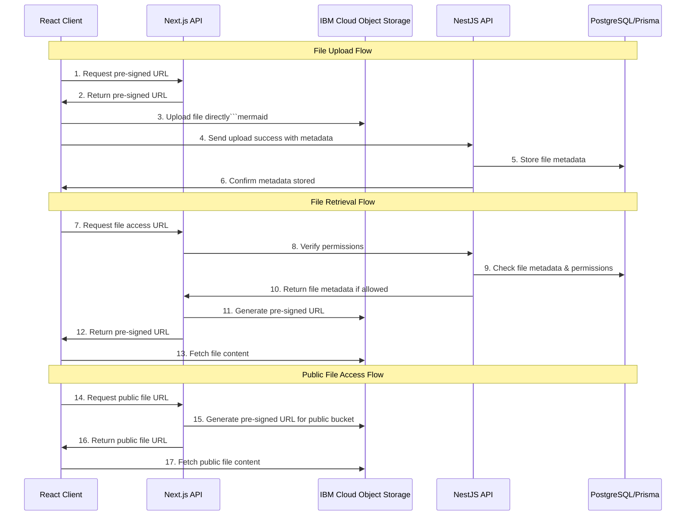

```mermaid
sequenceDiagram
    participant Client as React Client
    participant NextAPI as Next.js API
    participant COS as IBM Cloud Object Storage
    participant NestAPI as NestJS API
    participant DB as PostgreSQL/Prisma

    %% File Upload Flow
    Note over Client,DB: File Upload Flow
    Client->>NextAPI: 1. Request pre-signed URL
    NextAPI->>Client: 2. Return pre-signed URL
    Client->>COS: 3. Upload file directly```mermaid

    Client->>NestAPI: 4. Send upload success with metadata
    NestAPI->>DB: 5. Store file metadata
    NestAPI->>Client: 6. Confirm metadata stored

    %% File Retrieval Flow
    Note over Client,DB: File Retrieval Flow
    Client->>NextAPI: 7. Request file access URL
    NextAPI->>NestAPI: 8. Verify permissions
    NestAPI->>DB: 9. Check file metadata & permissions
    NestAPI->>NextAPI: 10. Return file metadata if allowed
    NextAPI->>COS: 11. Generate pre-signed URL
    NextAPI->>Client: 12. Return pre-signed URL
    Client->>COS: 13. Fetch file content
    
    %% Public File Access
    Note over Client,DB: Public File Access Flow
    Client->>NextAPI: 14. Request public file URL
    NextAPI->>COS: 15. Generate pre-signed URL for public bucket
    NextAPI->>Client: 16. Return public file URL
    Client->>COS: 17. Fetch public file content
```